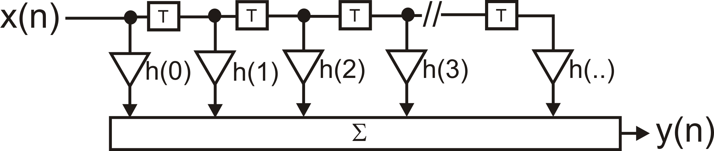
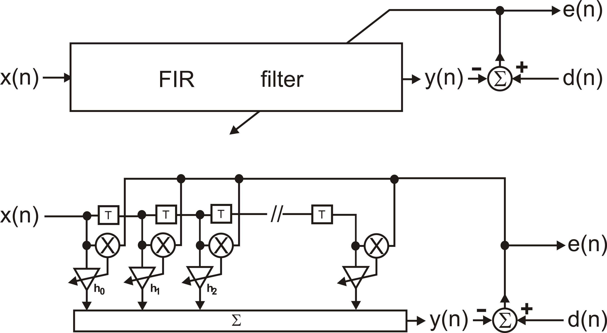
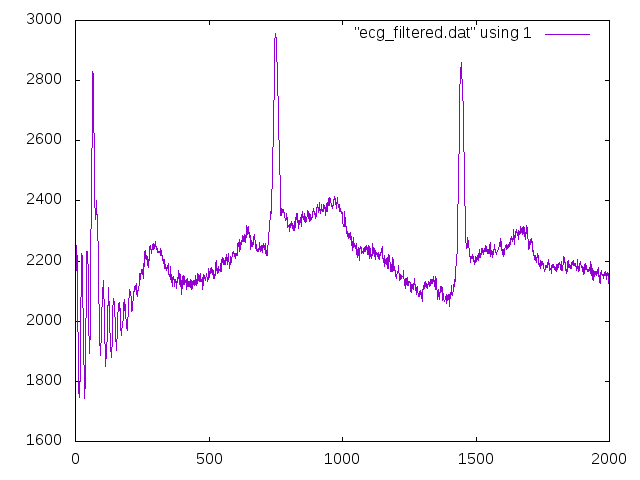

# FIR1



An efficient finite impulse response (FIR) filter class
in C++, JAVA wrapper for Android and Python wrapper.

The floating point class offers also adaptive filtering
using the least mean square (LMS) or normalised least mean
square (NLMS) algorithm.


## Installation

### Ubuntu packages for xenial, bionic and focal

Add this repository to your package manager:
```
sudo add-apt-repository ppa:berndporr/dsp
sudo apt-get update
sudo apt install fir1
sudo apt install fir1-dev
```
This adds `fir1-dev` and `fir1` to your package list.
The demo files are in `/usr/share/doc/fir1-dev`. Copy them into a working
directory, type `gunzip *.gz`, `cmake .` and `make`.

### MacOS packages (homebrew)

Make sure you have the homebrew package manager installed: https://brew.sh/

Add the homebrew tap:

```
brew tap berndporr/dsp
```

and then install the fir filter package with:

```
brew install fir
```


### Linux / Unix / MACOSX: compilation from source

The build system is `cmake`. Install the library with
the standard sequence:
```
cmake .
make
sudo make install
sudo ldconfig
```
or for debugging run cmake with:
```cmake -DCMAKE_BUILD_TYPE="Debug" .```
By default optimised release libraries are generated.

### Windows

Under windows only the static library is generated which
should be used for your code development.

```
cmake -G "Visual Studio 16 2019" -A x64 .
```
and then start Visual C++ and compile it. Usually
you want to compile both the release and debug
libraries because they are not compatible to each
other under Windows.

### Android / JAVA

The subdirectory `firj` contains an Android project. Load
it into Android studio and build it either as a release
or debug binary. This generates an Android aar which you
import into your project. See the `InstrumentedTest.java`
for an instructional example.

The pre-compiled libraries are here:
```Firj/firj/build/outputs/aar/firj-*.aar```

### Python

#### Installation from the python package index (PyPi)

Windows / Linux / Mac
```
    pip3 install fir1
```
under Windows it might be just `pip` for python3.


#### Installation from source

Windows / Linux / Mac: make sure that you have swig and a C++ compiler installed. Then type:
```
    python3 setup.py install
```


## How to use it

### cmake

Add to your `CMakeLists.txt` either

```
target_link_libraries(myexecutable fir)
```
for the dynamic library or

```
target_link_libraries(myexecutable fir_static)
```
for the statically linked library.

You can also use `find_package(fir)`.

### Generating the FIR filter coefficients

Set the coefficients either with a C floating point array or
with a text file containing the coefficients. The text file or
the floating point array with the
coefficients can easily be generated by Python or OCTAVE/MATLAB:

#### Python
Use the `firwin` command to generate the coefficients:
```
# Sampling rate
fs = 1000
# bandstop between 45 and 55 Hz:
f1 = 45
f2 = 55
b = signal.firwin(999,[f1/fs*2,f2/fs*2])
```
For fixed point you need to scale up the coefficients,
for example by 15 bits: b*32768.

#### octave/MATLAB:
```
octave:1> h=fir1(100,0.1);
```
which creates the coefficients of a lowpass filter with 100 taps
and normalised cutoff 0.1 to Nyquist.

Again, for fixed point "h" needs to be scaled.

### Initialisation

#### C++ floating point FIR filter:
```
Fir1 fir("h.dat");
```
or import the coefficients as a const double array:
```
Fir1 fir(coefficients)
```
there is also an option to import a non-const array (for example
generated with the ifft) and using std::vector.

#### C++ integer FIR filter:
```
Fir1fixed fir("h_fixed.dat",12);
```
where the coefficients have been scaled up by 2^12 and the
filter will scale them down by this amount (with the help of
a bitshift operation).

#### JAVA:
```
Fir1 fir = new Fir1(coeff);
```
where `coeff` is an array of double precision coefficients
and returns the fir filter class.

#### Python
```
f = fir1.Fir1(coeff)
```

### Realtime filtering

#### C++ double:
```
double b = fir.filter(a);
```

#### C++ integer:
```
int b = fir.filter(a);
```

#### JAVA:
```
double b = fir.filter(a)
```

#### Python
```
b = f.filter(a)
```
### Utility methods

These functions are the same in C++, JAVA and Python:

+ `getTaps()` returns the length of the FIR filter kernel.
+ `reset()` sets all delay lines to zero.
+ `zeroCoeff()` sets all coefficients to zero.

Retreiving the coefficients/kernel from the FIR filter is different depending on the
language used:

#### C++
+ `void getCoeff(double* target, unsigned length) const` copies the FIR kernel into the
given C array of `double`s with length `length`.

   If `length` exceeds the length of the filter kernel, the result is zero-padded to fill
the given array.

   If `length` is smaller than the filter kernel, a `std::out_of_range` exception is thrown.
   
+ `std::vector<double> getCoeffVector() const` returns a copy of the filter kernel.

#### Python
+ `getCoeff(n : int) -> numpy.array` as per the C++ method, following the zero-padding
and exception-throwing behaviour of the C++. The returned array will have `n` elements.
+ `getCoeff() -> numpy.array` additional to the C++ methods, this returns an numpy array
which is a copy of the filter kernel. This is probably the default use case in Python.


#### JAVA
+ `double[] getCoeff()` returns a double array of the filter kernel.
+ `double[] getCoeff(n : int)` as per the C++ method, following the zero-padding
and exception-throwing behaviour of the C++. The returned array will have `n` elements.


### Destructor

#### C++
```
delete fir;
```

#### JAVA
```
fir.release();
```
to release the underlying C++ class.


## LMS algorithm



The least mean square algorithm adjusts the FIR coefficients h_m
with the help of an error signal e(n):
```
h_m(n+1) = h_m(n) + learning_rate * h_m(n) * e(n)
```
using the function `lms_update(e)` while performing
the filtering with `filter()`.

### How to use the filter

- Construct the Fir filter with all coefficients set to zero: `Fir1(nCoeff)`
- Set the learning_rate with the method `setLearningRate(learning_rate)`.
- Provide the input signal `x` to the FIR filter and use its standard `filter` method to filter it.
- Define your error which needs to be minimised: `e = d - y`
- Feed the error back into the filter with the method `lms_update(e)`.

The `lmsdemo` in the demo directory makes this concept much clearer how to remove
artefacts with this method.



The above plot shows the filter in action which removes 50Hz noise with the adaptive
filter. Learning is very fast and the learning rate here is deliberately kept low to
show how it works.

### Stability

The FIR filter itself is stable but the error signal changes the filter coefficients which
in turn change the error and so on. There is a rule of thumb that the learning rate
should be less than the "tap power" of the input signal which is just the sum of all
squared values held in the different taps:
```
learning_rate < 1/getTapInputPower()
```
That allows an adaptive learning rate which is called "normalised LMS". From
my experiments that works in theory but in practise the realtime value of getTapInputPower()
can make the algorithm easily unstable because it might suggest infinite learning rates
and can fluctuate wildly. A better approach is to keep the learning rate constant and rather
control the power of the input signal by, for example, normalising the input signal or limiting
it.

See the demo below which removes 50Hz from an ECG which uses a normalised 50Hz signal
which guarantees stability by design.


### JAVA/Python

The commands under JAVA and Python are identical to C++.


## Demos
Demo programs are in the "demo" directory which show how to use the
filters for both floating point and fixed point.
1. `firdemo` sends an impulse into the filter and you should see the impulse
response at its output.
2. `fixeddemo` filters an example ECG with 50Hz noise. The coefficients
are 12 bit and you can generate them either with OCTAVE/MATLAB or Python.
The scripts are also provided.
3. `lmsdemo` filters out 50Hz noise from an ECG with the help of
adaptive filtering by using the 50Hz powerline frequency as the input
to the filter. This can be replaced by any reference artefact signal
or signal which is correlated with the artefact.
4. JAVA has an `InstrumentedTest` which filters both a delta pulse and
a step function.
5. filter_ecg.py performs the filtering of an ECG in python using
the fir1 python module which in turn calls internally the C++ functions.

## C++ documentation

The doxygen generated documentation can be found here:

 - Online: http://berndporr.github.io/fir1/index.html
 - PDF: https://github.com/berndporr/fir1/tree/master/docs/pdf

## Unit tests
Under C++ just run `make test` or `ctest`.

The JAVA wrapper contains an instrumented test which you can run on
your Android device.


## Credits

This library has been adapted form Graeme Hattan's original C code.

Enjoy!

Bernd Porr & Nick Bailey
